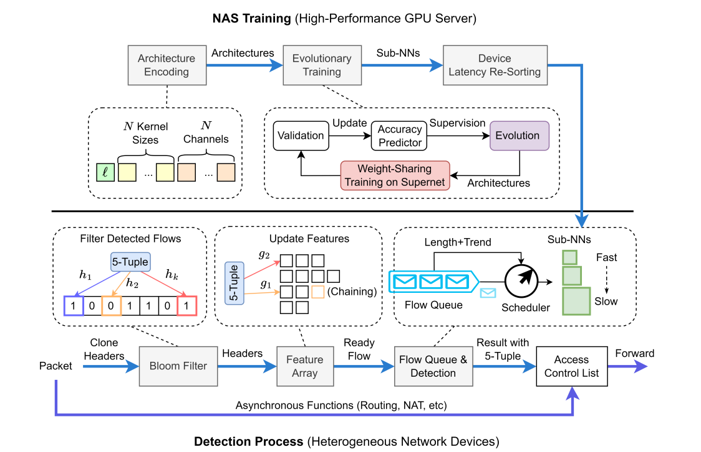

# SOTERIA  
Efficient Attack Detection with Multi-Latency Neural Models on Heterogeneous Network Devices (ICNP 2023)


Note: The unit of detection time in Fig 9 is **milliseconds**, and the term "microseconds" in the relevant section is wrong.

## Environment Setup
To get started, follow these steps:
1. Install the required dependencies:  
```  
pip install -r requirements.txt  
# The latest mmt package is required  
git clone https://github.com/makerlin1/MMT.git --depth=1  
cd MMT  
python install build  
python install install  
```  
2. Make sure to install the C++ version of MNN on both your server and target network device.
## NAS Training
Prepare your dataset, which should be organized as a dictionary with keys "train", "valid", and "test" for input data (X) and output labels (y). The dataset should be loaded using `torch.utils.data.Dataset` (check the [botdataset.py](./botdataset.py) for more details.).
Next, run the `train.sh` script for NAS training. Before executing this script, remember to set the `--data_path` in the script as the path of your dataset (e.g., we set it as dataset.pkl).  
```  
sh train.sh  
```
Note: Feel free to customize the hyperparameters in the YAML files within the [NSGA](./NSGA/) directory to better suit your specific task.

## Device Latency Re-sorting
First, create a new directory named `ops_list` and run the `get_ops_list.py` program (located in the root directory). This script generates all the basic operators (Ops) of the supernet in the `ops_list` directory.  
```python  
python get_ops_list.py  
```  
To measure the real latency of Ops on your target device, run the following code:  
```python  
from mmt.meter import meter_ops  
meter_ops("ops_list")  
```  
Next, create a new directory named `models` in the root directory. The device latency re-sorting is implemented in the `resort.py` script. Run the script using the following command:  
```python  
python resort.py  
```  
The final output will be similar to the example below, displaying the suggested models with their accuracy and latency:  
```yaml  
Model name                                            Acc    Latency  
------------------------------------------------  -------  ---------  
./models/soteria_acc1_96.322434_latency_0.122467  96.3224   0.122467  
./models/soteria_acc1_98.415320_latency_0.193567  98.4153   0.193567  
./models/soteria_acc1_99.070213_latency_0.302434  99.0702   0.302434  
./models/soteria_acc1_98.510031_latency_0.264667  98.51     0.264667  
...                                              ...      ...  
```

## Detection Process
For a detailed explanation of the detection process, please refer to the [README.md](./Detection/README.md) file in the `Detection` folder.
To perform mixed inference, you need to set the model candidates in line 43 of the [MNN_process.cpp](./Detection/cpu/MNN_process.cpp) file as follows:  
```c++  
string g_modelList[MAX_MODEL_COUNT] = {     // These models need to be sorted from lowest to highest accuracy  
       "../../models/soteria_acc1_96.322434_latency_0.122467.mnn",  
       "../../models/soteria_acc1_98.415320_latency_0.193567.mnn",  
       "../../models/soteria_acc1_98.510031_latency_0.264667.mnn",  
        "../../models/soteria_acc1_99.070213_latency_0.302434.mnn"  
};  
```  
Sort the models from the lowest to the highest accuracy according to the output from the device latency re-sorting step.

